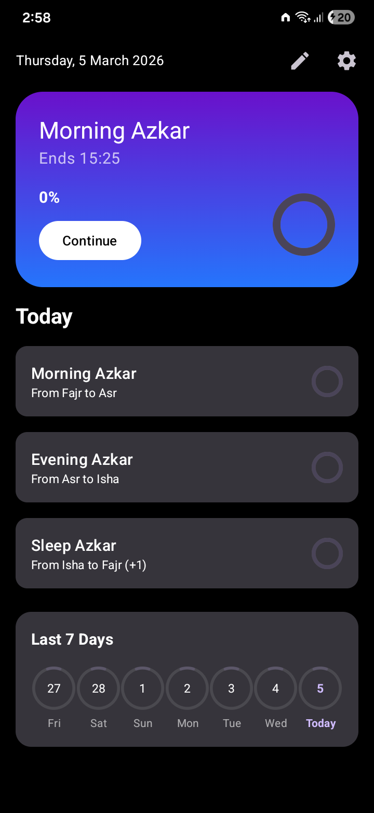
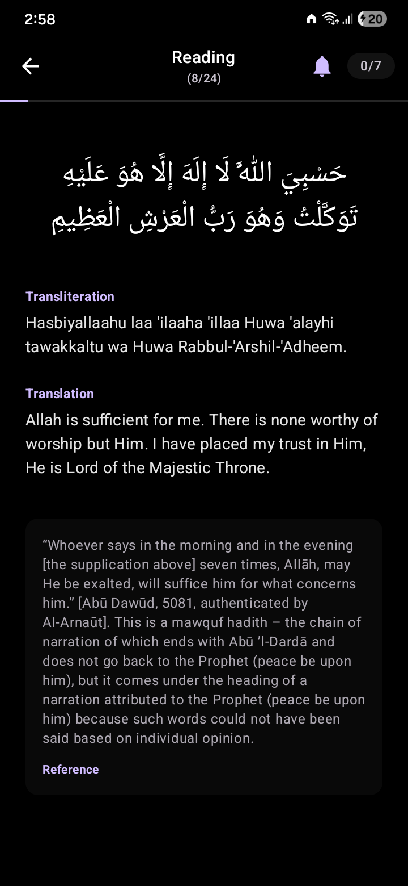
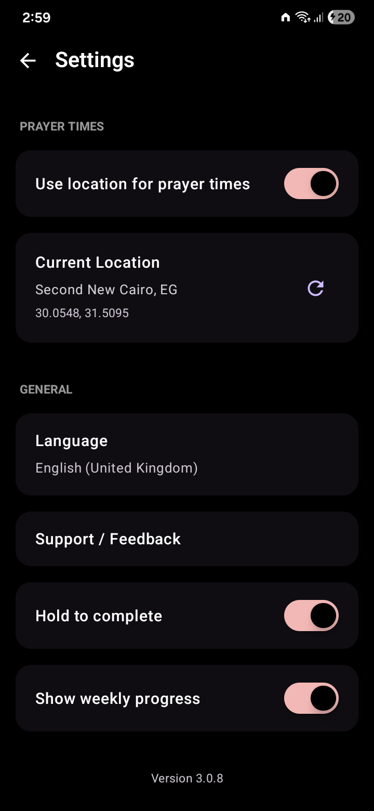

<div id="top" align="center">

[](https://github.com/KareemSarhan/Azkary)

[](https://github.com/KareemSarhan/Azkary)
[](LICENSE)
[](https://developer.android.com/about/versions/13)
[](https://kotlinlang.org/)
[](https://github.com/KareemSarhan/Azkary)
[](https://f-droid.org/packages/com.app.azkary/)
[](https://github.com/KareemSarhan/Azkary/releases)
[](https://github.com/KareemSarhan/Azkary/commits)

</div>

# Azkary — Islamic Remembrance (Azkar) App

A beautiful, privacy-focused Islamic remembrance (Azkar) app with prayer times, progress tracking, and customizable categories. 100% offline, no ads, no tracking.

**Star us on GitHub — it helps the project grow!**

[](https://x.com/intent/tweet?text=Check%20out%20Azkary%20-%20Beautiful%20Islamic%20remembrance%20app%20with%20prayer%20times:%20https://github.com/KareemSarhan/Azkary%20%23IslamicApp%20%23Azkar%20%23F-Droid)
[](https://www.linkedin.com/sharing/share-offsite/?url=https://github.com/KareemSarhan/Azkary)
[](https://www.reddit.com/submit?title=Azkary%20-%20Privacy-focused%20Islamic%20remembrance%20app&url=https://github.com/KareemSarhan/Azkary)
[](https://t.me/share/url?url=https://github.com/KareemSarhan/Azkary&text=Check%20out%20Azkary%20-%20Islamic%20remembrance%20app)

## Overview

For Muslims worldwide who want to maintain their daily dhikr routine with authentic remembrances, prayer time integration, and beautiful progress tracking — all while keeping their data completely private.

[](https://play.google.com/store/apps/details?id=com.app.azkary)
[](https://f-droid.org/packages/com.app.azkary)
[](https://github.com/KareemSarhan/Azkary/releases)

### How it works

1. **Open the app** — Your daily Azkar categories are automatically shown based on prayer times
2. **Read and count** — Tap to increment counters as you complete each dhikr
3. **Track progress** — Visual indicators show your completion status for each category
4. **Customize** — Create your own categories and add custom dhikr as needed

## Why Azkary

- **Authentic Azkar** — Morning (25), Evening (22), and Sleep (16) remembrances with hadith references
- **Prayer Time Integration** — Automatic scheduling based on your location's prayer times
- **Smart Progress Tracking** — Weighted completion calculation based on text length and repetitions
- **Beautiful Design** — Material Design 3 with dark mode and OLED support
- **Multi-Language** — Full Arabic and English interface with RTL support
- **Custom Categories** — Create and organize your own dhikr collections
- **100% Offline** — No internet required after initial setup
- **Privacy First** — No data collection, no tracking, no ads — ever

## Azkar Categories

### Authentic Islamic Content

Each dhikr includes:
- **Arabic text** with proper Uthmani script
- **Transliteration** for proper pronunciation
- **English translation** for understanding
- **Hadith reference** with source citations

### Prayer-Time-Based Scheduling

Categories are automatically scheduled based on prayer times:

| Category                         | Time Window | Items           |
|----------------------------------|-------------|-----------------|
| **Morning Azkar** (أذكار الصباح) | Fajr → Asr  | 25 remembrances |
| **Evening Azkar** (أذكار المساء) | Asr → Isha  | 22 remembrances |
| **Sleep Azkar** (أذكار النوم)    | Isha → Fajr | 16 remembrances |

### Custom Categories

Create personalized collections:
- Ramadan-specific Azkar
- Friday remembrances
- Personal daily routine
- Special occasion dhikr

## Privacy First

**Azkary does not collect, store, or transmit any personal data.**

- All data stored locally on your device
- No analytics or crash reporting services
- No internet connection required for core functionality
- Location permission is optional (only for prayer times)
- Open source — verify the code yourself

## Screenshots

<table>
<tr>
<td></td>
<td></td>
<td></td>
<td></td>
</tr>
<tr>
<td align="center">Home</td>
<td align="center">Reading</td>
<td align="center">Settings</td>
<td align="center">Categories</td>
</tr>
</table>

## Quick Start

```bash
# Clone repository
git clone https://github.com/KareemSarhan/Azkary.git
cd Azkary

# Build debug APK
./gradlew assembleDebug

# Install on device
adb install app/build/outputs/apk/debug/app-debug.apk
```

### Requirements

- **Android**: 13+ (API 33)
- **Android Studio**: Ladybug 2024.2.1 or newer
- **JDK**: 17
- **Compile SDK**: 36

## Tech Stack

<p align="center">
  <br>
  
</p>

**Architecture**: MVVM • Jetpack Compose • Room • Coroutines • Flow • Hilt • Material Design 3

### Key Libraries

| Category             | Technology                               |
|----------------------|------------------------------------------|
| Language             | Kotlin 2.0+                              |
| UI Framework         | Jetpack Compose with Material 3          |
| Architecture         | MVVM with Repository pattern             |
| Dependency Injection | Hilt/Dagger                              |
| Database             | Room (SQLite)                            |
| Preferences          | DataStore                                |
| Networking           | Retrofit + OkHttp + Kotlin Serialization |
| Async                | Kotlin Coroutines + Flow                 |

## Features in Detail

### Reading Experience
- Full-screen reading interface with swipeable pages
- Tap-to-increment counter for repetition tracking
- Auto-advance to next dhikr when completed
- Haptic feedback on interactions
- Progress bar showing weighted completion

### Progress Tracking
- Daily progress monitoring for each category
- Weighted progress calculation based on text length and repetitions
- Circular progress indicators on summary cards
- Persistent storage of user progress per date
- Current session highlighting on home screen

### Localization
- System language detection (Arabic/English)
- Manual language selection via Settings
- RTL/LTR layout automatic switching
- Localized content for all categories and items
- Bidirectional text rendering support

### Theming
- Material Design 3 dynamic theming
- Light and dark theme support
- True black (OLED) option for battery saving
- Smooth animations for progress changes
- Responsive layouts for different screen sizes

## Contributing

We welcome contributions! Please see our [Contributing Guidelines](CONTRIBUTING.md) for details.

### Quick Start for Contributors

1. Fork the repository
2. Create a feature branch: `git checkout -b feature/amazing-feature`
3. Commit your changes: `git commit -m 'Add amazing feature'`
4. Push to the branch: `git push origin feature/amazing-feature`
5. Open a Pull Request

### Development Commands

```bash
./gradlew assembleDebug      # Build debug APK
./gradlew assembleRelease    # Build release APK
./gradlew test               # Run unit tests
./gradlew connectedCheck     # Run instrumentation tests
./gradlew lint               # Check code style
```

Please read our [Code of Conduct](CODE_OF_CONDUCT.md) before participating.

## Roadmap

- [ ] Push notifications for prayer times
- [ ] Widget for home screen
- [ ] Backup/restore functionality
- [ ] Additional calculation methods for prayer times
- [ ] More languages (Urdu, French, Turkish)
- [ ] iOS version

See [open issues](https://github.com/KareemSarhan/Azkary/issues) for proposed features and known issues.

## Contributors

Thanks goes to these wonderful people ([emoji key](https://allcontributors.org/docs/en/emoji-key)):

<!-- ALL-CONTRIBUTORS-LIST:START - Do not remove or modify this section -->
<!-- prettier-ignore-start -->
<!-- markdownlint-disable -->
<table>
  <tbody>
    <tr>
      <td align="center" valign="top" width="14.28%"><a href="https://github.com/KareemSarhan"><br /><sub><b>Kareem Sarhan</b></sub></a><br /><a href="https://github.com/KareemSarhan/Azkary/commits?author=KareemSarhan" title="Code">💻</a> <a href="#design" title="Design">🎨</a></td>
    </tr>
  </tbody>
</table>
<!-- markdownlint-restore -->
<!-- prettier-ignore-end -->
<!-- ALL-CONTRIBUTORS-LIST:END -->

This project follows the [all-contributors](https://github.com/all-contributors/all-contributors) specification. Contributions of any kind welcome!

## Star History

[](https://star-history.com/#KareemSarhan/Azkary&Date)

## Support

For support, email [azkary@hearo.support](mailto:azkary@hearo.support) or open an [issue](https://github.com/KareemSarhan/Azkary/issues).

## License

GNU General Public License v3.0 — see [LICENSE](LICENSE) for details.

This means:
- You can use, modify, and distribute this app
- You can create forks and derivative works
- Changes must be released under GPL-3.0
- You cannot distribute proprietary/closed-source versions

---

<p align="center">
<a href="https://github.com/KareemSarhan/Azkary/releases">Download</a> •
<a href="https://github.com/KareemSarhan/Azkary/issues">Report Bug</a> •
<a href="https://github.com/KareemSarhan/Azkary/issues">Request Feature</a> •
<a href="https://github.com/KareemSarhan/Azkary/discussions">Discussions</a>
</p>
