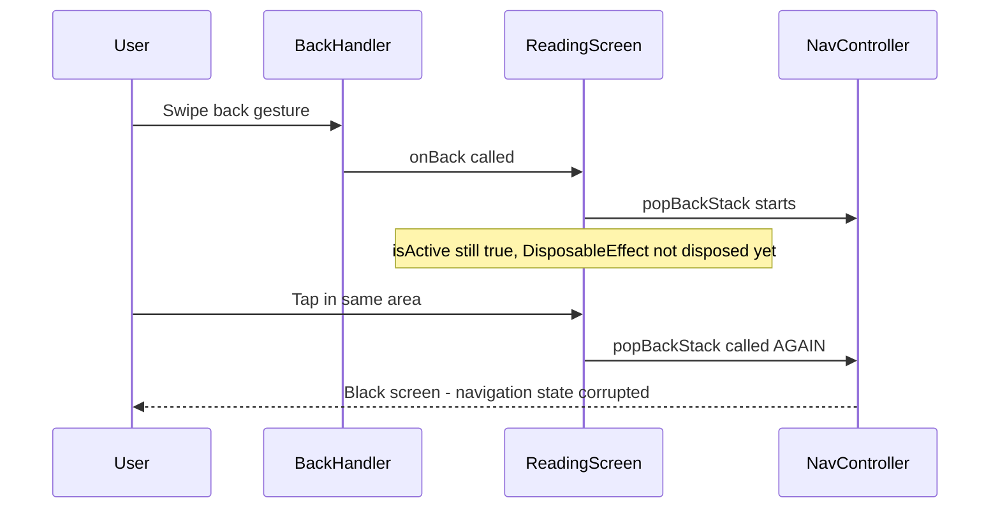

# Black Screen Navigation Bug Fix Plan

## Problem Description

When on the Zekr reading page, using gesture navigation to go back and then pressing in the same
area (either the back button or the "go back to summary" button on the completion screen) causes the
screen to go black.

## Root Cause Analysis

The issue is a **race condition causing double-navigation** when using gesture navigation followed
by a tap in the same area.

### Code Flow Analysis



### Problematic Code Sections

#### 1. ReadingScreen.kt - Back Handler with isActive check

```kotlin
// Lines 70-80
var isActive by remember { mutableStateOf(true) }

DisposableEffect(Unit) {
    onDispose {
        isActive = false  // Too late - happens after navigation completes
    }
}

BackHandler(enabled = isActive) {
    if (isActive) onBack()  // Check exists but race condition possible
}
```

#### 2. ReadingScreen.kt - TopBar Back Button

```kotlin
// Line 157
IconButton(onClick = { if (isActive) onBack() }) {
    // Has isActive check but race condition still possible
}
```

#### 3. CompletionScreen.kt - NO isActive check

```kotlin
// Lines 65-75
Button(
    onClick = onBackToSummary,  // NO PROTECTION - directly calls onBack
    modifier = Modifier.fillMaxWidth().height(56.dp)
) {
    Text(text = stringResource(R.string.completion_back_to_summary))
}
```

### Why the Black Screen Occurs

1. First `popBackStack()` is called from gesture - begins navigation
2. Second `popBackStack()` is called from tap while first navigation is in progress
3. NavController state becomes corrupted - it pops more than intended or gets into invalid state
4. Result: Black screen with no content

## Proposed Solution

### Fix Strategy: Immediate State Invalidation

Instead of relying on `DisposableEffect.onDispose` to set `isActive = false`, we should:

1. Set `isActive = false` **immediately** when any navigation action is triggered
2. Pass this protection to CompletionScreen
3. Add a navigation guard wrapper function

### Implementation Plan

#### Step 1: Create a Safe Navigation Wrapper in ReadingScreen

```kotlin
// Add a wrapper function that handles safe navigation
val safeOnBack: () -> Unit = {
    if (isActive) {
        isActive = false  // Immediately disable before navigation
        onBack()
    }
}
```

#### Step 2: Update BackHandler to Use Safe Navigation

```kotlin
BackHandler(enabled = isActive) {
    safeOnBack()
}
```

#### Step 3: Update TopBar Back Button

```kotlin
IconButton(onClick = safeOnBack) {
    Icon(...)
}
```

#### Step 4: Pass isActive to CompletionScreen

Update CompletionScreen signature:

```kotlin
@Composable
fun CompletionScreen(
    onBackToSummary: () -> Unit,
    isEnabled: Boolean = true,  // New parameter
    modifier: Modifier = Modifier
) {
    // ...
    Button(
        onClick = { if (isEnabled) onBackToSummary() },
        // ...
    )
}
```

Update call site in ReadingScreen:

```kotlin
CompletionScreen(
    onBackToSummary = safeOnBack,
    isEnabled = isActive,
    modifier = Modifier.fillMaxSize()
)
```

## Files to Modify

| File                                                                                     | Changes                                                                                               |
|------------------------------------------------------------------------------------------|-------------------------------------------------------------------------------------------------------|
| [`ReadingScreen.kt`](app/src/main/java/com/app/azkary/ui/reading/ReadingScreen.kt)       | Add safe navigation wrapper, update BackHandler, update IconButton, pass isActive to CompletionScreen |
| [`CompletionScreen.kt`](app/src/main/java/com/app/azkary/ui/reading/CompletionScreen.kt) | Add isEnabled parameter, add check in Button onClick                                                  |

## Alternative Solutions Considered

### Option A: Use NavController popBackStack with lifecycle check

- Check if NavController is already navigating before calling popBackStack
- **Rejected**: NavController doesn't expose navigation state easily

### Option B: Add delay between navigation calls

- Add a small delay to prevent double-taps
- **Rejected**: Hacky solution, affects user experience

### Option C: Use launchedEffect with navigation state

- Track navigation in a StateFlow
- **Rejected**: Over-engineered for this simple race condition

## Testing Plan

1. **Gesture + Tap Test**: Swipe back and immediately tap in the same area
2. **Completion Button Test**: Complete azkar, swipe back, tap completion button area
3. **Normal Navigation Test**: Ensure regular back navigation still works
4. **Rapid Tap Test**: Rapidly tap back button to ensure no double-navigation

## Summary

The fix is straightforward: immediately invalidate the `isActive` state when navigation begins,
rather than waiting for `DisposableEffect.onDispose`. This prevents the race condition where a
gesture followed by a tap triggers double-navigation.
