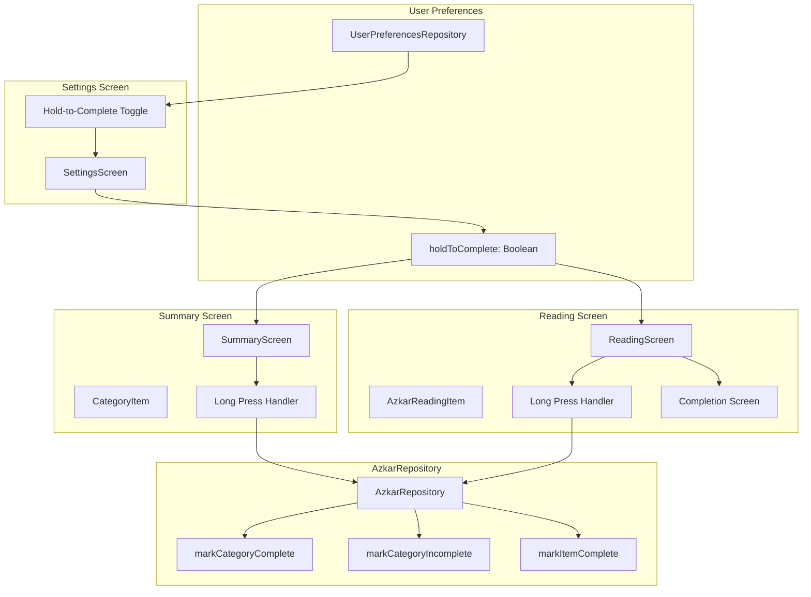
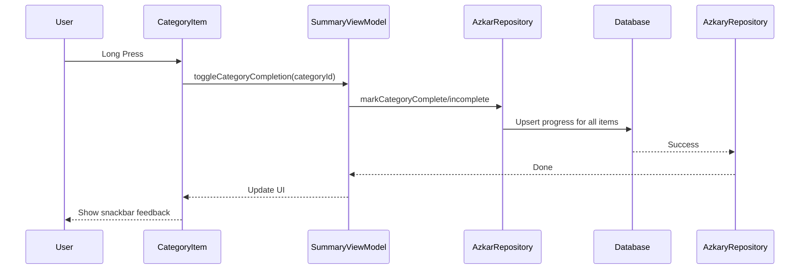
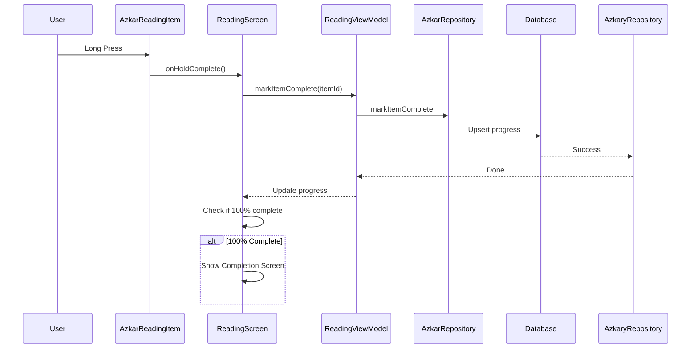

# Hold-to-Complete Features Implementation Plan

## Overview

This plan outlines the implementation of three features:

1. **Completion Page** - Show completion screen when zikr category reading is finished
2. **Hold Functionality - Category** - Long-press on category marks it complete/incomplete
3. **Hold Functionality - Zikr Reading** - Long-press on zikr marks it complete + settings toggle

---

## Architecture Diagram



---

## Implementation Steps

### Step 1: Add hold-to-complete preference to UserPreferencesRepository

**File:** `app/src/main/java/com/app/azkary/data/prefs/UserPreferencesRepository.kt`

**Changes:**

1. Add `HOLD_TO_COMPLETE` preference key (booleanPreferencesKey)
2. Add `holdToComplete: Flow<Boolean>` property (default: true)
3. Add `setHoldToComplete(enabled: Boolean)` method

```kotlin
private val HOLD_TO_COMPLETE = booleanPreferencesKey("hold_to_complete")

val holdToComplete: Flow<Boolean> = context.dataStore.data.map { preferences ->
    preferences[HOLD_TO_COMPLETE] ?: true
}

suspend fun setHoldToComplete(enabled: Boolean) {
    context.dataStore.edit { it[HOLD_TO_COMPLETE] = enabled }
}
```

---

### Step 2: Add hold-to-complete toggle to Settings screen

**File:** `app/src/main/java/com/app/azkary/ui/settings/SettingsScreen.kt`

**Changes:**

1. Observe `holdToComplete` from `SettingsViewModel`
2. Add `SettingsToggleItem` in the GENERAL section
3. Connect toggle to `viewModel.setHoldToComplete()`

**File:** `app/src/main/java/com/app/azkary/ui/settings/SettingsViewModel.kt`

**Changes:**

1. Inject `UserPreferencesRepository`
2. Add `holdToComplete: Flow<Boolean>` property
3. Add `setHoldToComplete(enabled: Boolean)` method

---

### Step 3: Implement long-press on category item in SummaryScreen

**File:** `app/src/main/java/com/app/azkary/ui/summary/SummaryScreen.kt`

**Changes:**

1. Add `Modifier.combinedClickable` to `CategoryItem` composable
2. Implement long-press handler:
    - If category is incomplete (progress < 100%): Mark all items as complete
    - If category is complete (progress >= 100%): Mark all items as incomplete
3. Add haptic feedback on long-press
4. Add visual feedback (toast or snackbar)

**File:** `app/src/main/java/com/app/azkary/ui/summary/SummaryViewModel.kt`

**Changes:**

1. Add `toggleCategoryCompletion(categoryId: String)` method
2. Call repository to mark all items complete/incomplete

**File:** `app/src/main/java/com/app/azkary/data/repository/AzkarRepository.kt`

**Changes:**

1. Add `markCategoryComplete(categoryId: String, date: String)` method
2. Add `markCategoryIncomplete(categoryId: String, date: String)` method

---

### Step 4: Implement long-press on zikr item in ReadingScreen

**File:** `app/src/main/java/com/app/azkary/ui/reading/AzkarReadingItem.kt`

**Changes:**

1. Add `Modifier.combinedClickable` to the Surface
2. Implement long-press handler that triggers `onHoldComplete()`
3. Add visual feedback for hold action

**File:** `app/src/main/java/com/app/azkary/ui/reading/ReadingScreen.kt`

**Changes:**

1. Observe `holdToComplete` setting from ViewModel
2. Pass `onHoldComplete` callback to `AzkarReadingItem`
3. If hold-to-complete is enabled:
    - Long-press marks item as complete (sets repeats to requiredRepeats)
4. If hold-to-complete is disabled:
    - Long-press shows a message/toast indicating it's disabled

**File:** `app/src/main/java/com/app/azkary/ui/reading/ReadingViewModel.kt`

**Changes:**

1. Observe `holdToComplete` from UserPreferencesRepository
2. Add `markItemComplete(itemId: String)` method
3. Call repository to mark item complete

**File:** `app/src/main/java/com/app/azkary/data/repository/AzkarRepository.kt`

**Changes:**

1. Add `markItemComplete(categoryId: String, itemId: String, date: String)` method

---

### Step 5: Add completion screen when category reading is finished

**File:** `app/src/main/java/com/app/azkary/ui/reading/ReadingScreen.kt`

**Changes:**

1. Observe `weightedProgress` from ViewModel
2. When progress reaches 100%, show completion dialog/screen
3. Completion screen includes:
    - "MashaAllah" or similar celebration message
    - Category name
    - "Back to Summary" button
    - Optional: Share option

**Alternative - Bottom Sheet approach:**
Create a `CompletionBottomSheet` composable that slides up when progress reaches 100%.

**File:** `app/src/main/java/com/app/azkary/ui/reading/CompletionScreen.kt` (new file)

**New composable:**

```kotlin
@Composable
fun CompletionScreen(
    categoryName: String,
    onBackToSummary: () -> Unit,
    onShare: () -> Unit
)
```

---

### Step 6: Add string resources for new UI elements

**File:** `app/src/main/res/values/strings.xml`

**Add:**

```xml
<!-- Hold-to-Complete Settings -->
<string name="settings_hold_to_complete_title">Hold to complete</string>
<string name="settings_hold_to_complete_description">Long-press on items to mark them complete</string>

<!-- Completion Screen -->
<string name="completion_title">MashaAllah!</string>
<string name="completion_message">You completed %s</string>
<string name="completion_back_to_summary">Back to Summary</string>
<string name="completion_share">Share</string>

<!-- Long Press Feedback -->
<string name="hold_to_complete_disabled">Hold-to-complete is disabled in settings</string>
<string name="category_marked_complete">Category marked complete</string>
<string name="category_marked_incomplete">Category marked incomplete</string>
```

---

### Step 7: Update Arabic translations

**File:** `app/src/main/res/values-ar/strings.xml`

**Add Arabic translations for all new strings:**

```xml
<!-- Hold-to-Complete Settings -->
<string name="settings_hold_to_complete_title">الضغط المطول للاكتمال</string>
<string name="settings_hold_to_complete_description">اضغط مطولاً على العناصر لوضع علامة اكتمل</string>

<!-- Completion Screen -->
<string name="completion_title">ماشاء الله!</string>
<string name="completion_message">أكملت %s</string>
<string name="completion_back_to_summary">العودة للملخص</string>
<string name="completion_share">مشاركة</string>

<!-- Long Press Feedback -->
<string name="hold_to_complete_disabled">الضغط المطول للاكتمال معطل في الإعدادات</string>
<string name="category_marked_complete">تم وضع علامة اكتمال على الفئة</string>
<string name="category_marked_incomplete">تم وضع علامة عدم اكتمال على الفئة</string>
```

---

## Data Layer Changes

### AzkarRepository.kt - New Methods

```kotlin
/**
 * Mark all items in a category as complete for a given date
 */
suspend fun markCategoryComplete(categoryId: String, date: String) {
    val crossRefs = categoryItemDao.getAllCrossRefsForCategory(categoryId).first()
    crossRefs.filter { it.isEnabled }.forEach { crossRef ->
        val item = itemDao.getItemById(crossRef.itemId).first() ?: return@forEach
        progressDao.upsertProgress(
            UserProgressEntity(
                categoryId = categoryId,
                itemId = crossRef.itemId,
                date = date,
                currentRepeats = item.requiredRepeats,
                isCompleted = true
            )
        )
    }
}

/**
 * Mark all items in a category as incomplete for a given date
 */
suspend fun markCategoryIncomplete(categoryId: String, date: String) {
    val crossRefs = categoryItemDao.getAllCrossRefsForCategory(categoryId).first()
    crossRefs.filter { it.isEnabled }.forEach { crossRef ->
        progressDao.upsertProgress(
            UserProgressEntity(
                categoryId = categoryId,
                itemId = crossRef.itemId,
                date = date,
                currentRepeats = 0,
                isCompleted = false
            )
        )
    }
}

/**
 * Mark a single item as complete
 */
suspend fun markItemComplete(categoryId: String, itemId: String, date: String) {
    val item = itemDao.getItemById(itemId).first() ?: return
    progressDao.upsertProgress(
        UserProgressEntity(
            categoryId = categoryId,
            itemId = itemId,
            date = date,
            currentRepeats = item.requiredRepeats,
            isCompleted = true
        )
    )
}
```

---

## UI Flow

### Summary Screen - Long Press on Category



### Reading Screen - Long Press on Zikr



---

## Testing Considerations

1. **Unit Tests:**
    - Test `UserPreferencesRepository` hold-to-complete preference
    - Test `AzkarRepository` mark complete/incomplete methods

2. **Integration Tests:**
    - Test long-press on category updates UI correctly
    - Test long-press on zikr updates progress correctly
    - Test completion screen appears at 100%
    - Test settings toggle enables/disables hold functionality

3. **Manual Testing:**
    - Test hold duration (too short vs too long)
    - Test haptic feedback
    - Test completion screen navigation
    - Test share functionality

---

## Estimated Files to Modify

1. `app/src/main/java/com/app/azkary/data/prefs/UserPreferencesRepository.kt`
2. `app/src/main/java/com/app/azkary/ui/settings/SettingsViewModel.kt`
3. `app/src/main/java/com/app/azkary/ui/settings/SettingsScreen.kt`
4. `app/src/main/java/com/app/azkary/ui/summary/SummaryViewModel.kt`
5. `app/src/main/java/com/app/azkary/ui/summary/SummaryScreen.kt`
6. `app/src/main/java/com/app/azkary/ui/reading/ReadingViewModel.kt`
7. `app/src/main/java/com/app/azkary/ui/reading/ReadingScreen.kt`
8. `app/src/main/java/com/app/azkary/ui/reading/AzkarReadingItem.kt`
9. `app/src/main/java/com/app/azkary/data/repository/AzkarRepository.kt`
10. `app/src/main/java/com/app/azkary/ui/reading/CompletionScreen.kt` (new)
11. `app/src/main/res/values/strings.xml`
12. `app/src/main/res/values-ar/strings.xml`

---

## Ready to Implement?

Would you like me to proceed with implementing this plan? I can start with:

1. Adding the hold-to-complete preference
2. Implementing the settings toggle
3. Or any other specific part of the plan