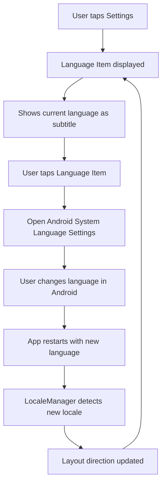

# Language Settings Simplification Plan

## Goal
Simplify the language settings in the app by replacing the in-app language selector with a single option that redirects to Android's app-specific language settings.

## Current State
- `SettingsScreen.kt` has `LanguageSelector` composable with 3 radio button options (System Default, English, Arabic)
- `SettingsViewModel.kt` has `changeLanguage()` methods that modify language via `AppCompatDelegate.setApplicationLocales()`
- `LocaleManager.kt` provides language management using AppCompatDelegate
- `UserPreferencesRepository` stores language preference in DataStore
- `MainActivity` uses `appLanguage` flow for layout direction calculation

## Proposed Changes

### 1. Create New `LanguageItem` Composable
Replace `LanguageSelector` with a simple clickable item:
- Title: "Language"
- Subtitle: Current language display name (e.g., "English", "العربية", "System Default")
- On click: Open Android's app-specific language settings via `Intent(Settings.ACTION_APP_LANGUAGE_SETTINGS)`

### 2. Keep `UserPreferencesRepository` for Compatibility
- Keep `appLanguage` flow for reading current language
- Keep `AppLanguage` enum for display names
- Remove `setAppLanguage()` method (no longer needed)
- Remove `APP_LANGUAGE` preference key

### 3. Update `LocaleManager`
- Keep methods for reading current locale:
  - `getCurrentLocale()`
  - `getCurrentLanguageTag()`
  - `isCurrentLocaleRtl()`
- Remove methods for changing language:
  - `changeLanguage()`
  - `setSystemDefault()`
  - `initializeLocale()`

### 4. Update `SettingsViewModel`
- Remove `changeLanguage()` method
- Remove `setAppLanguage()` method
- Add method to get current language display name for subtitle

### 5. Update `MainActivity`
- Update to use `LocaleManager.getCurrentLocale()` directly instead of DataStore flow
- This ensures layout direction reflects actual system app language setting

## Files to Modify

| File | Changes |
|------|---------|
| `app/src/main/java/com/app/azkary/ui/settings/SettingsScreen.kt` | Replace `LanguageSelector` with `LanguageItem` |
| `app/src/main/java/com/app/azkary/ui/settings/SettingsViewModel.kt` | Remove language change methods, add subtitle method |
| `app/src/main/java/com/app/azkary/util/LocaleManager.kt` | Remove change language methods |
| `app/src/main/java/com/app/azkary/data/prefs/UserPreferencesRepository.kt` | Remove `setAppLanguage()` and `APP_LANGUAGE` key |
| `app/src/main/java/com/app/azkary/MainActivity.kt` | Use `LocaleManager` directly for layout direction |
| `app/src/main/res/values/strings.xml` | Add any needed strings |

## Files to Delete (optional)
- `app/src/main/java/com/app/azkary/util/LocaleManager.kt` - If completely replaced by Android's built-in locale handling

## Implementation Order
1. Add new string resources for language display names
2. Create `LanguageItem` composable in `SettingsScreen.kt`
3. Update `SettingsViewModel` to remove language change logic
4. Update `SettingsScreen` to use `LanguageItem`
5. Update `LocaleManager` to be read-only
6. Update `UserPreferencesRepository` to remove language persistence
7. Update `MainActivity` to use `LocaleManager` directly
8. Test the implementation

## Mermaid Flow Diagram

## Key Considerations
- The app must declare `android:localeConfig` in `AndroidManifest.xml` (already present)
- Android 13+ provides the app-specific language settings UI
- For older Android versions, we may need to handle gracefully or show a message
- The `AppCompatDelegate.getApplicationLocales()` API is available on Android 13+