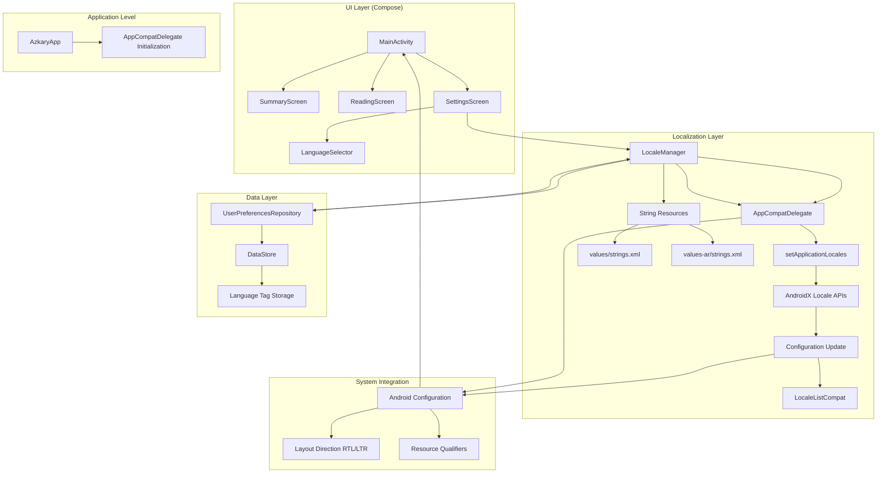
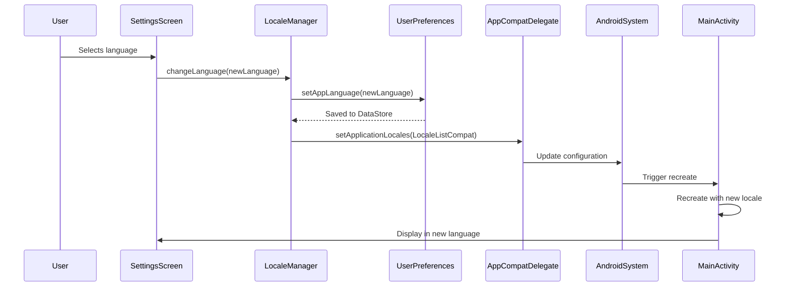
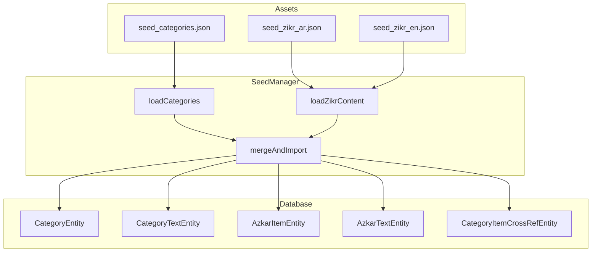

# Multi-Language Implementation Plan
## Arabic & English with RTL/LTR Support (Modern Android Approach)

---

## Table of Contents
1. [Current State Analysis](#current-state-analysis)
2. [Implementation Strategy](#implementation-strategy)
3. [System Architecture](#system-architecture)
4. [Multi-Seed File Architecture](#multi-seed-file-architecture)
5. [Production-Ready Enhancements](#production-ready-enhancements)
6. [Implementation Phases](#implementation-phases)
7. [Technical Implementation Details](#technical-implementation-details)
8. [Implementation Checklist](#implementation-checklist)

---

## Current State Analysis

The Azkary app already has:
- Basic locale configuration in [`locales_config.xml`](../app/src/main/res/xml/locales_config.xml) (en, ar)
- Language preference system in [`UserPreferencesRepository`](../app/src/main/java/com/app/azkary/data/prefs/UserPreferencesRepository.kt)
- RTL layout handling in [`MainActivity`](../app/src/main/java/com/app/azkary/MainActivity.kt) based on language
- Basic string resource structure (minimal)
- Single [`seed_azkar.json`](../app/src/main/assets/seed_azkar.json) file containing all content

---

## Implementation Strategy

### Phase 1: Foundation Setup
1. **String Resources Creation**
   - Extract all hardcoded strings from UI components using Android Studio inspections/lint
   - Create comprehensive English strings in `values/strings.xml`
   - Create Arabic translations in `values-ar/strings.xml`
   - Include all UI text, error messages, and content descriptions

2. **Modern Locale Management System**
   - Use `AppCompatDelegate.setApplicationLocales()` (AndroidX) as primary approach
   - Supports Android 13+ per-app language settings and backward compatibility
   - Store language tag in DataStore (already implemented)
   - Keep ContextWrapper only as fallback for specific OEM/device issues if discovered

### Phase 2: UI Components Update
3. **Settings Screen Enhancement**
   - Replace system language intent with in-app language switcher
   - Add language selection UI with radio buttons
   - Show current selected language
   - Trigger `AppCompatDelegate.setApplicationLocales()` on selection
   - Handle activity recreation automatically

4. **Screen-by-Screen String Migration**
   - **SummaryScreen**: Update all hardcoded text to use `stringResource()`
   - **ReadingScreen**: Handle mixed content properly with BidiFormatter
   - **SettingsScreen**: Complete language settings implementation
   - Any other screens with hardcoded text

### Phase 3: RTL/LTR Enhancement
5. **Compose-Specific Layout Direction**
   - Compose reads `LayoutDirection` from configuration automatically
   - Use `LocalLayoutDirection` for direction-aware components
   - Ensure UI uses `start/end` instead of `left/right` everywhere
   - Use `autoMirrored` for vector drawables that need mirroring
   - Activity recreation handles direction updates automatically

6. **Mixed Content Handling with BidiFormatter**
   - Use `BidiFormatter` (AndroidX/ICU) for strings mixing Arabic + numbers + Latin
   - Handle verse numbers, references, and "(1/10)" counters specifically
   - Test page indicators, progress displays, and mixed titles
   - Use explicit bidi controls where needed

### Phase 4: Advanced Features
7. **Date/Time Localization**
   - Update date formatting based on locale using `java.time` APIs
   - Handle Hijri/Gregorian calendar display if needed
   - Ensure proper number formatting in RTL context
   - Use locale-specific formatters

8. **Font and Typography**
   - Ensure Arabic fonts render properly with system fonts
   - Handle font sizing differences between languages
   - Maintain consistent UI appearance across languages
   - Test with different device font settings

### Phase 5: Testing and Polish
9. **Comprehensive Testing**
   - Test all screens in both languages
   - Verify RTL behavior throughout the app
   - Check text alignment and layout consistency
   - Test language switching and persistence
   - **Screenshot tests** in both locales
   - **UI tests** verifying language persistence after cold start

10. **Edge Cases and Android 13 Integration**
    - Handle Android 13 per-app language settings properly
    - In-app selector should sync with system "App language" setting
    - Ensure proper app restart behavior
    - Handle missing translations gracefully
    - Test on different API levels and OEM devices

---

## System Architecture

### System Architecture Diagram



### Data Flow for Language Switching (Modern Approach)



### Component Responsibilities

#### 1. LocaleManager (Modern Implementation)
- **Purpose**: Centralized language management using AndroidX APIs
- **Responsibilities**:
  - Call `AppCompatDelegate.setApplicationLocales()` for language changes
  - Store language preference in DataStore
  - Provide current locale information
  - Handle system default language reset
- **Key Decision**: Use AppCompatDelegate as primary, ContextWrapper only as fallback

#### 2. String Resources
- **Structure**: Hierarchical resource organization
  ```
  res/
  ├── values/
  │   └── strings.xml (English - default)
  ├── values-ar/
  │   └── strings.xml (Arabic)
  └── values-night/
      └── strings.xml (Night mode overrides)
  ```
- **Naming Convention**: snake_case with screen prefixes
  - `settings_language`, `summary_today`, `reading_page_counter`

#### 3. Settings Screen Enhancement
- **Current**: Opens system language settings
- **Enhanced**: In-app language selector with:
  - Radio button selection
  - Loading indicator during language change
  - Immediate feedback via AppCompatDelegate
  - Automatic activity recreation

#### 4. RTL/LTR Handling (Compose-Specific)
- **Automatic**: Compose reads `LayoutDirection` from configuration
- **Best Practices**:
  - Use `start/end` modifiers instead of `left/right`
  - Use `autoMirrored()` for drawable resources
  - Access `LocalLayoutDirection` for custom logic
  - Activity recreation handles direction updates

#### 5. Mixed Content Handling
- **Tool**: `BidiFormatter` from AndroidX Core
- **Use Cases**:
  - Arabic text with numbers (e.g., "1/10")
  - Verse numbers and references
  - Progress percentages
  - Page counters
- **Implementation**: Wrap mixed content with `bidiFormatter.unicodeWrap()`

---

## Multi-Seed File Architecture

### Seed File Structure
```
app/src/main/assets/
├── seed_categories.json          # Shared categories (all languages)
├── seed_zikr_ar.json             # Arabic zikr content only
└── seed_zikr_en.json             # English zikr content only
```

### Data Flow Diagram



### Seed File Specifications

#### 1. seed_categories.json (Shared)
Contains category definitions with multilingual names. Categories are shared across all languages since they represent the same logical groupings.

```json
{
  "schemaVersion": 4,
  "generatedAt": "2026-01-30T00:00:00Z",
  "categories": [
    {
      "categoryId": "cat-morning",
      "from": 0,
      "to": 3,
      "type": "DEFAULT",
      "systemKey": "MORNING",
      "sortOrder": 0,
      "isArchived": false,
      "texts": {
        "ar": {
          "name": "أذكار الصباح"
        },
        "en": {
          "name": "Morning Adhkar"
        }
      },
      "items": [
        {
          "itemId": "itm-hamd-salah-001",
          "sortOrder": 0,
          "isEnabled": true
        }
      ]
    }
  ]
}
```

#### 2. seed_zikr_ar.json (Arabic Content)
Contains only Arabic zikr content. Islamic content remains authentic and unchanged.

```json
{
  "schemaVersion": 4,
  "generatedAt": "2026-01-30T00:00:00Z",
  "language": "ar",
  "items": [
    {
      "itemId": "itm-hamd-salah-001",
      "requiredRepeats": 1,
      "source": "SEEDED",
      "texts": {
        "ar": {
          "title": "دعاء العافية",
          "text": "اللَّهُمَّ إِنِّي أَسْأَلُكَ الْعَفْوَ وَالْعَافِيَةَ...",
          "referenceText": "[Abu Dawud, 5074]"
        }
      }
    }
  ]
}
```

#### 3. seed_zikr_en.json (English Content)
Contains only English translations and transliterations.

```json
{
  "schemaVersion": 4,
  "generatedAt": "2026-01-30T00:00:00Z",
  "language": "en",
  "items": [
    {
      "itemId": "itm-hamd-salah-001",
      "requiredRepeats": 1,
      "source": "SEEDED",
      "texts": {
        "en": {
          "title": "Supplication for Well-being",
          "text": "Allāhumma innī as'alukal-'afwa wal'āfiyata...",
          "translation": "O Allah, I seek Your forgiveness and Your protection...",
          "referenceText": "[Abu Dawud, 5074]"
        }
      }
    }
  ]
}
```

### Seed Models Update

```kotlin
@Serializable
data class SeedPack(
    val schemaVersion: Int,
    val generatedAt: String,
    val categories: List<SeedCategory>? = null,  // Optional for category seed
    val items: List<SeedItem>? = null,          // Optional for zikr seed
    val language: String? = null                // Language tag for zikr seeds
)

@Serializable
data class SeedCategory(
    val categoryId: String,
    val type: CategoryType,
    val systemKey: SystemCategoryKey? = null,
    val sortOrder: Int,
    val isArchived: Boolean,
    val texts: Map<String, SeedCategoryText>,
    val items: List<SeedCategoryItemRef>,
    val from: Int,
    val to: Int
)

@Serializable
data class SeedItem(
    val itemId: String,
    val requiredRepeats: Int,
    val source: AzkarSource,
    val texts: Map<String, SeedItemText>
)
```

### Enhanced SeedManager

```kotlin
@Singleton
class SeedManager @Inject constructor(
    private val database: AzkarDatabase,
    private val json: Json
) {
    private val jsonConfig = Json {
        ignoreUnknownKeys = true
        coerceInputValues = true
    }

    // Seed files
    private val CATEGORY_SEED_FILE = "seed_categories.json"
    private val ZIKR_SEED_FILES = listOf(
        "seed_zikr_ar.json",
        "seed_zikr_en.json"
    )

    suspend fun seedIfNeeded(context: Context) {
        try {
            // Load categories first
            val categorySeed = loadSeedFile(context, CATEGORY_SEED_FILE)
            val categoryPack = jsonConfig.decodeFromString<SeedPack>(categorySeed)
            
            // Load all zikr content
            val zikrPacks = ZIKR_SEED_FILES.map { fileName ->
                val zikrSeed = loadSeedFile(context, fileName)
                jsonConfig.decodeFromString<SeedPack>(zikrSeed)
            }
            
            val currentDbVersion = database.getDbVersion()
            val seedVersion = categoryPack.schemaVersion
            
            println("DEBUG: SeedManager - Current DB version: $currentDbVersion, Seed schema version: $seedVersion")
            
            if (currentDbVersion < seedVersion) {
                println("DEBUG: SeedManager - Starting seed import")
                importSeedData(categoryPack, zikrPacks)
                println("DEBUG: SeedManager - Seed import completed")
            } else {
                println("DEBUG: SeedManager - Skipping seed import - DB version is up to date")
            }
        } catch (e: Exception) {
            println("DEBUG: SeedManager - Error during seeding: ${e.message}")
            e.printStackTrace()
        }
    }

    private fun loadSeedFile(context: Context, fileName: String): String {
        return context.assets.open(fileName).bufferedReader().use { it.readText() }
    }

    private suspend fun importSeedData(
        categoryPack: SeedPack,
        zikrPacks: List<SeedPack>
    ) {
        database.withTransaction {
            val categoryDao = database.categoryDao()
            val categoryTextDao = database.categoryTextDao()
            val itemDao = database.azkarItemDao()
            val textDao = database.azkarTextDao()
            val crossRefDao = database.categoryItemDao()

            // 1. Import categories and their texts
            val availableItemIds = mutableSetOf<String>()
            
            categoryPack.categories?.forEach { seedCat ->
                // Insert category
                categoryDao.insertCategory(
                    CategoryEntity(
                        categoryId = seedCat.categoryId,
                        type = seedCat.type,
                        systemKey = seedCat.systemKey,
                        sortOrder = seedCat.sortOrder,
                        isArchived = seedCat.isArchived,
                        from = seedCat.from,
                        to = seedCat.to
                    )
                )

                // Insert category texts
                val categoryTexts = seedCat.texts.map { (lang, text) ->
                    CategoryTextEntity(seedCat.categoryId, lang, text.name)
                }
                categoryTextDao.upsertCategoryTexts(categoryTexts)

                // Track available item IDs from category references
                seedCat.items.forEach { ref ->
                    availableItemIds.add(ref.itemId)
                }
            }

            // 2. Import zikr content from all language files
            zikrPacks.forEach { zikrPack ->
                zikrPack.items?.forEach { seedItem ->
                    // Insert or update item
                    itemDao.upsertItems(
                        listOf(
                            AzkarItemEntity(
                                itemId = seedItem.itemId,
                                requiredRepeats = seedItem.requiredRepeats,
                                source = seedItem.source
                            )
                        )
                    )

                    // Insert or update item texts for this language
                    val itemTexts = seedItem.texts.map { (lang, content) ->
                        AzkarTextEntity(
                            itemId = seedItem.itemId,
                            langTag = lang,
                            title = content.title,
                            text = content.text,
                            translation = content.translation,
                            referenceText = content.referenceText
                        )
                    }
                    textDao.upsertTexts(itemTexts)
                }
            }

            // 3. Link items to categories via crossrefs
            categoryPack.categories?.forEach { seedCat ->
                seedCat.items.forEach { ref ->
                    if (availableItemIds.contains(ref.itemId)) {
                        crossRefDao.insertCrossRef(
                            CategoryItemCrossRefEntity(
                                categoryId = seedCat.categoryId,
                                itemId = ref.itemId,
                                sortOrder = ref.sortOrder,
                                isEnabled = ref.isEnabled
                            )
                        )
                    }
                }
            }
        }
    }
}
```

### Benefits of Multi-Seed Architecture

#### 1. **Content Separation**
- Islamic content (Arabic) remains authentic and unchanged
- Translations are separate and can be updated independently
- Categories are shared across all languages

#### 2. **Maintainability**
- Each language file is smaller and easier to manage
- Translators can work on separate files without conflicts
- Clear separation of concerns

#### 3. **Flexibility**
- Easy to add new languages by creating new seed files
- Can update translations without touching Arabic content
- Categories can be updated once for all languages

#### 4. **Performance**
- Smaller files load faster
- Can load only needed language content
- Better memory management

#### 5. **Version Control**
- Easier to track changes per language
- Clear diff history for each language
- Simpler merge conflicts

### Migration Strategy

#### Phase 1: Prepare New Seed Files
1. Extract categories from `seed_azkar.json` → `seed_categories.json`
2. Extract Arabic content from `seed_azkar.json` → `seed_zikr_ar.json`
3. Extract English content from `seed_azkar.json` → `seed_zikr_en.json`
4. Update schema version to 4

#### Phase 2: Update SeedManager
1. Modify `seedIfNeeded()` to load multiple files
2. Implement `loadSeedFile()` helper method
3. Update `importSeedData()` to handle multi-file import
4. Add proper error handling for missing files

#### Phase 3: Testing
1. Test database seeding with new structure
2. Verify all content is imported correctly
3. Test language switching displays correct content
4. Validate database integrity

#### Phase 4: Deployment
1. Deploy with schema version increment
2. Monitor for any issues
3. Keep old seed file as backup temporarily

---

## Production-Ready Enhancements

### 1. LocaleManager API Shape - Expose State, Not Just Actions

**Problem:** Current design only exposes actions, forcing UI to guess state.

**Solution:** Expose `currentLocale` as `StateFlow<Locale>` for reactive UI.

```kotlin
class LocaleManager @Inject constructor(
    private val context: Context,
    private val userPreferencesRepository: UserPreferencesRepository
) {
    // Expose current locale as StateFlow for UI to react
    val currentLocale: StateFlow<Locale> = userPreferencesRepository.appLanguage
        .map { language ->
            when (language) {
                AppLanguage.ARABIC -> Locale("ar")
                AppLanguage.ENGLISH -> Locale("en")
                AppLanguage.SYSTEM -> Locale.getDefault()
            }
        }
        .stateIn(
            scope = CoroutineScope(Dispatchers.Default),
            started = SharingStarted.WhileSubscribed(5000),
            initialValue = Locale.getDefault()
        )

    suspend fun setLanguage(language: AppLanguage) {
        val localeTag = when (language) {
            AppLanguage.SYSTEM -> null
            AppLanguage.ARABIC -> "ar"
            AppLanguage.ENGLISH -> "en"
        }
        
        userPreferencesRepository.setAppLanguage(language)
        
        val localeList = if (localeTag != null) {
            LocaleListCompat.forLanguageTags(localeTag)
        } else {
            LocaleListCompat.getEmptyLocaleList()
        }
        
        AppCompatDelegate.setApplicationLocales(localeList)
    }
    
    fun getCurrentLocale(): Locale {
        return AppCompatDelegate.getApplicationLocales()
            .get(0) ?: Locale.getDefault()
    }
}
```

**Benefits:**
- UI can react to locale changes instead of guessing
- Simplifies testing with observable state
- Prevents reading from AppCompatDelegate directly in UI
- Follows reactive programming patterns

**Usage in Compose:**
```kotlin
@Composable
fun SettingsScreen(
    localeManager: LocaleManager
) {
    val currentLocale by localeManager.currentLocale.collectAsState()
    
    // UI can react to locale changes
    Text("Current: ${currentLocale.displayLanguage}")
}
```

### 2. Avoid Double Recreation During Startup

**Problem:** Common pitfall causes activity to recreate twice:
1. App launches
2. DataStore emits saved language
3. `setApplicationLocales()` called again
4. Activity recreates twice (startup jank)

**Solution:** Only call `setApplicationLocales()` if different from current.

```kotlin
suspend fun setLanguage(language: AppLanguage) {
    val localeTag = when (language) {
        AppLanguage.SYSTEM -> null
        AppLanguage.ARABIC -> "ar"
        AppLanguage.ENGLISH -> "en"
    }
    
    userPreferencesRepository.setAppLanguage(language)
    
    val localeList = if (localeTag != null) {
        LocaleListCompat.forLanguageTags(localeTag)
    } else {
        LocaleListCompat.getEmptyLocaleList()
    }
    
    // Avoid double recreation: only call if different from current
    val currentLocales = AppCompatDelegate.getApplicationLocales()
    if (currentLocales != localeList) {
        AppCompatDelegate.setApplicationLocales(localeList)
    }
}
```

**Benefits:**
- Prevents subtle startup jank
- Avoids unnecessary activity recreations
- Improves app launch performance
- Better user experience

### 3. Settings Screen UX - Disable Rapid Taps

**Problem:** Rapid taps on language options cause:
- Multiple `setApplicationLocales()` calls
- Unexpected back stack behavior
- Potential race conditions

**Solution:** Disable language selector while switching.

```kotlin
@Composable
fun LanguageSelector(
    currentLanguage: AppLanguage,
    onLanguageSelected: (AppLanguage) -> Unit,
    isApplying: Boolean = false
) {
    val languages = listOf(
        AppLanguage.SYSTEM to stringResource(R.string.system_default),
        AppLanguage.ENGLISH to stringResource(R.string.english),
        AppLanguage.ARABIC to stringResource(R.string.arabic)
    )
    
    Column {
        if (isApplying) {
            Row(
                modifier = Modifier
                    .fillMaxWidth()
                    .padding(16.dp),
                verticalAlignment = Alignment.CenterVertically
            ) {
                CircularProgressIndicator(
                    modifier = Modifier.size(24.dp),
                    strokeWidth = 2.dp
                )
                Spacer(modifier = Modifier.width(16.dp))
                Text(stringResource(R.string.applying_language))
            }
        }
        
        languages.forEach { (language, displayName) ->
            LanguageOption(
                language = language,
                displayName = displayName,
                isSelected = currentLanguage == language,
                onClick = { onLanguageSelected(language) },
                enabled = !isApplying  // Disable while applying
            )
        }
    }
}

@Composable
fun LanguageOption(
    language: AppLanguage,
    displayName: String,
    isSelected: Boolean,
    onClick: () -> Unit,
    enabled: Boolean
) {
    Row(
        modifier = Modifier
            .fillMaxWidth()
            .clickable(enabled = enabled, onClick = onClick)  // Respect enabled state
            .padding(16.dp),
        verticalAlignment = Alignment.CenterVertically
    ) {
        RadioButton(
            selected = isSelected,
            onClick = onClick,
            enabled = enabled  // Disable radio button too
        )
        Spacer(modifier = Modifier.padding(start = 16.dp))
        Text(
            text = displayName,
            style = MaterialTheme.typography.bodyLarge,
            color = if (enabled) MaterialTheme.colorScheme.onSurface 
                    else MaterialTheme.colorScheme.onSurface.copy(alpha = 0.38f)
        )
    }
}
```

**Benefits:**
- Prevents multiple rapid language changes
- Clear visual feedback during language switch
- Avoids race conditions
- Better UX with disabled state

### 4. RTL-Specific Testing Assertions

**Problem:** Visual diffs sometimes miss logical mirroring bugs.

**Solution:** Add hard RTL assertions in screenshot tests.

```kotlin
@Test
fun testSettingsScreenRTL() {
    // Set locale to Arabic
    val locale = Locale("ar")
    Locale.setDefault(locale)
    
    val composeTestRule = createComposeRule()
    
    composeTestRule.setContent {
        AzkaryTheme {
            SettingsScreen(
                onBack = {},
                viewModel = hiltViewModel()
            )
        }
    }
    
    // Visual assertions (existing)
    composeTestRule.onNodeWithText("الإعدادات").assertIsDisplayed()
    
    // NEW: Hard RTL assertions
    composeTestRule.onNodeWithText("اللغة")
        .assertTextDirectionIs(TextDirection.Rtl)
    
    // Assert icon order (mirrored in RTL)
    composeTestRule.onNodeWithTag("language_row")
        .assertChildrenOrder(expected = listOf("text", "icon"))
    
    // Assert text alignment
    composeTestRule.onNodeWithText("مواقيت الصلاة")
        .assertTextAlignmentIs(TextAlign.End)  // RTL aligns to end (right in RTL)
    
    // Assert row child order (mirrored)
    composeTestRule.onNodeWithTag("settings_item_row")
        .assertFirstChildHasTag("text")
        .assertLastChildHasTag("arrow")
}
```

**Custom Test Helpers:**
```kotlin
fun SemanticsNodeInteraction.assertTextDirectionIs(
    expected: TextDirection
): SemanticsNodeInteraction {
    return assert(SemanticsMatcher.expectValue(
        TextDirectionTestTag,
        expected
    ))
}

fun SemanticsNodeInteraction.assertChildrenOrder(
    expected: List<String>
): SemanticsNodeInteraction {
    val actual = fetchSemanticsNode().children.map { 
        it.config.getOrNull(SemanticsProperties.TestTag) 
    }
    assertEquals(expected, actual)
    return this
}
```

**Benefits:**
- Catches logical mirroring bugs visual diffs miss
- Ensures proper RTL behavior
- Prevents regressions
- More comprehensive test coverage

---

## Implementation Phases

### Phase 1: Foundation (Week 1)
1. Extract all hardcoded strings using Android Studio lint
2. Create comprehensive string resources (English + Arabic)
3. Implement LocaleManager with AppCompatDelegate
4. Remove manual context wrapping (use AndroidX APIs)
5. Update MainActivity to use AppCompatDelegate

### Phase 2: UI Integration (Week 2)
1. Replace system language intent with in-app selector
2. Update all screens to use `stringResource()`
3. Implement language switching with loading state
4. Add BidiFormatter for mixed content
5. Test language switching and persistence

### Phase 3: RTL Enhancement (Week 3)
1. Replace `left/right` with `start/end` modifiers
2. Add `autoMirrored()` to relevant drawables
3. Test RTL behavior on all screens
4. Handle edge cases with mixed content
5. Verify proper text alignment

### Phase 4: Testing & Polish (Week 4)
1. Screenshot tests in both locales
2. UI tests for language persistence after cold start
3. Test on Android 13+ with per-app language settings
4. Test on multiple API levels and OEM devices
5. Performance optimization and edge case handling

---

## Technical Implementation Details

### Modern Locale Manager (AppCompatDelegate Approach)
```kotlin
class LocaleManager @Inject constructor(
    private val context: Context,
    private val userPreferencesRepository: UserPreferencesRepository
) {
    suspend fun changeLanguage(language: AppLanguage) {
        val localeTag = when (language) {
            AppLanguage.SYSTEM -> null // Reset to system default
            AppLanguage.ARABIC -> "ar"
            AppLanguage.ENGLISH -> "en"
        }
        
        // Store preference
        userPreferencesRepository.setAppLanguage(language)
        
        // Apply using AndroidX AppCompat (works on all API levels)
        val localeList = if (localeTag != null) {
            LocaleListCompat.forLanguageTags(localeTag)
        } else {
            LocaleListCompat.getEmptyLocaleList()
        }
        
        AppCompatDelegate.setApplicationLocales(localeList)
        // Activity recreation happens automatically
    }
    
    fun getCurrentLocale(): Locale {
        return AppCompatDelegate.getApplicationLocales()
            .get(0) ?: Locale.getDefault()
    }
}
```

### String Resources Structure
```xml
<!-- values/strings.xml (English - default) -->
<resources>
    <!-- App Navigation -->
    <string name="app_name">Azkary</string>
    <string name="settings">Settings</string>
    <string name="summary">Summary</string>
    <string name="reading">Reading</string>
    
    <!-- Settings Screen -->
    <string name="prayer_times">PRAYER TIMES</string>
    <string name="use_location_for_prayer_times">Use location for prayer times</string>
    <string name="current_location">Current Location</string>
    <string name="not_available">Not available</string>
    <string name="general">GENERAL</string>
    <string name="language">Language</string>
    
    <!-- Summary Screen -->
    <string name="today">Today</string>
    <string name="no_categories_for_today">No categories for today</string>
    <string name="scheduled">Scheduled</string>
    <string name="completed">%d%% Completed</string>
    <string name="continue_reading">Continue</string>
    <string name="missed">Missed</string>
    <string name="ends_at">Ends %s</string>
    
    <!-- Reading Screen -->
    <string name="page_counter">%d of %d</string>
    <string name="repeat_counter">%d / %d</string>
    
    <!-- Language Selection -->
    <string name="system_default">System Default</string>
    <string name="english">English</string>
    <string name="arabic">العربية</string>
    <string name="applying_language">Applying language changes...</string>
</resources>
```

```xml
<!-- values-ar/strings.xml (Arabic) -->
<resources>
    <!-- App Navigation -->
    <string name="app_name">أذكاري</string>
    <string name="settings">الإعدادات</string>
    <string name="summary">الملخص</string>
    <string name="reading">القراءة</string>
    
    <!-- Settings Screen -->
    <string name="prayer_times">مواقيت الصلاة</string>
    <string name="use_location_for_prayer_times">استخدم الموقع لمواقيت الصلاة</string>
    <string name="current_location">الموقع الحالي</string>
    <string name="not_available">غير متاح</string>
    <string name="general">عام</string>
    <string name="language">اللغة</string>
    
    <!-- Summary Screen -->
    <string name="today">اليوم</string>
    <string name="no_categories_for_today">لا توجد فئات لليوم</string>
    <string name="scheduled">مجدول</string>
    <string name="completed">%d%% مكتمل</string>
    <string name="continue_reading">متابعة</string>
    <string name="missed">فائت</string>
    <string name="ends_at">ينتهي %s</string>
    
    <!-- Reading Screen -->
    <string name="page_counter">%d من %d</string>
    <string name="repeat_counter">%d / %d</string>
    
    <!-- Language Selection -->
    <string name="system_default">النظام الافتراضي</string>
    <string name="english">English</string>
    <string name="arabic">العربية</string>
    <string name="applying_language">جاري تطبيق تغييرات اللغة...</string>
</resources>
```

### Mixed Content Handling with BidiFormatter
```kotlin

object TextUtils {
    private val bidiFormatter = BidiFormatter.getInstance()
    
    /**
     * Formats text with proper bidi handling for mixed Arabic/English content
     */
    fun formatMixedText(text: String): String {
        return bidiFormatter.unicodeWrap(text)
    }
    
    /**
     * Formats a counter like "1/10" with proper bidi handling
     */
    fun formatCounter(current: Int, total: Int): String {
        val counter = "$current/$total"
        return bidiFormatter.unicodeWrap(counter)
    }
    
    /**
     * Formats a percentage like "50%" with proper bidi handling
     */
    fun formatPercentage(value: Int): String {
        val percentage = "$value%"
        return bidiFormatter.unicodeWrap(percentage)
    }
}

// Usage in Compose
@Composable
fun PageCounter(currentPage: Int, totalPages: Int) {
    Text(
        text = TextUtils.formatCounter(currentPage, totalPages),
        style = MaterialTheme.typography.labelSmall
    )
}
```

### Compose RTL Best Practices
```kotlin
// Use start/end instead of left/right
Row(
    modifier = Modifier
        .fillMaxWidth()
        .padding(horizontal = 16.dp) // Good
        .padding(start = 16.dp)      // Good
        .padding(left = 16.dp)       // AVOID - doesn't work in RTL
) {
    // Content
}

// Use autoMirrored for drawable resources that need mirroring
Icon(
    painter = painterResource(R.drawable.ic_arrow_left),
    contentDescription = null,
    modifier = Modifier.autoMirrored() // Mirrors automatically in RTL
)

// LocalLayoutDirection is available for custom components
@Composable
fun DirectionAwareContent() {
    val layoutDirection = LocalLayoutDirection.current
    val isRtl = layoutDirection == LayoutDirection.Rtl
    
    // Use direction for custom logic
}
```

---

## Implementation Checklist

### UI Internationalization (12 tasks)
- [ ] Create comprehensive string resources for both English and Arabic
- [ ] Add Arabic string resources file (values-ar/strings.xml)
- [ ] Update English string resources with all hardcoded strings
- [ ] Implement in-app language switcher in Settings screen
- [ ] Create locale manager utility for runtime language changes
- [ ] Update all UI screens to use string resources instead of hardcoded text
- [ ] Enhance RTL/LTR layout handling for Arabic content
- [ ] Update text direction handling for mixed content (Arabic/English)
- [ ] Test and verify proper RTL behavior in all screens
- [ ] Update date/time formatting for locale-specific display
- [ ] Ensure proper font handling for Arabic text
- [ ] Add language persistence and app restart handling

### Seed File Architecture (10 tasks)
- [ ] Create seed_categories.json with shared category definitions
- [ ] Create seed_zikr_ar.json with Arabic zikr content only
- [ ] Create seed_zikr_en.json with English zikr content only
- [ ] Update SeedModels.kt with optional fields for multi-seed support
- [ ] Update SeedManager.kt to load multiple seed files
- [ ] Add language-specific seed loading logic
- [ ] Update database schema version to 4
- [ ] Test database seeding with new multi-seed structure
- [ ] Verify content display in both languages
- [ ] Remove old seed_azkar.json after successful migration

### Production Enhancements (15 tasks)
- [ ] Add `currentLocale` StateFlow to LocaleManager
- [ ] Update setLanguage to avoid double recreation
- [ ] Update UI to use currentLocale StateFlow
- [ ] Add tests for locale state changes
- [ ] Add isApplying state to language selector
- [ ] Disable language options while applying
- [ ] Add loading indicator
- [ ] Test rapid tap scenarios
- [ ] Add RTL-specific test assertions
- [ ] Create custom test helpers for RTL
- [ ] Add screenshot tests for Arabic locale
- [ ] Assert icon order in RTL
- [ ] Assert text alignment in RTL
- [ ] Assert row child order in RTL

---

## Key Technical Decisions

### 1. AppCompatDelegate as Primary Approach
- **Rationale**: Official AndroidX API for locale management
- **Benefits**:
  - Works on all API levels (back to API 16)
  - Integrates with Android 13+ per-app language settings
  - Automatic activity recreation
  - No manual configuration manipulation
- **Fallback**: ContextWrapper only if device-specific issues discovered

### 2. No attachBaseContext Override Needed
- **Rationale**: AppCompatDelegate handles locale application
- **Benefit**: Simpler code, fewer edge cases
- **Exception**: Only if specific OEM issues require fallback

### 3. Compose-Specific RTL Handling
- **Automatic**: Layout direction updates with configuration
- **Best Practices**:
  - Use `start/end` modifiers throughout
  - Use `autoMirrored()` for directional icons
  - Access `LocalLayoutDirection` for custom logic
  - Test visual appearance in both directions

### 4. BidiFormatter for Mixed Content
- **Rationale**: Handles complex bidi scenarios reliably
- **Use Cases**: Numbers, percentages, counters in Arabic text
- **Implementation**: Centralized utility with formatting methods

### 5. String Resource Organization
- **Strategy**: Categorize by screen/component
- **Naming**: snake_case with prefixes
- **Tooling**: Use Android Studio lint to find hardcoded strings

---

## Success Metrics

### Functional Requirements
- [ ] 100% string resource coverage (verified via lint)
- [ ] Seamless language switching with AppCompatDelegate
- [ ] Proper RTL behavior with start/end modifiers
- [ ] Language persistence across app restarts
- [ ] Android 13 per-app language settings integration

### Quality Requirements
- [ ] No hardcoded strings in code
- [ ] Consistent translation quality
- [ ] Proper text alignment in both directions
- [ ] Smooth user experience during language change

### Performance Requirements
- [ ] Language switching completes within one activity recreate
- [ ] UI responsive during language change (loading indicator)
- [ ] No jank or crashes during transition
- [ ] Minimal memory overhead from locale resources

### Testing Requirements
- [ ] Screenshot tests pass in both locales
- [ ] UI tests verify language persistence after cold start
- [ ] Manual testing on Android 13+ devices
- [ ] Testing on multiple API levels and OEM devices

---

## Risk Mitigation

### 1. AppCompatDelegate Compatibility
- **Risk**: Some OEM devices may have issues
- **Mitigation**: Keep ContextWrapper as documented fallback
- **Monitoring**: Crash reporting to identify device-specific issues
- **Testing**: Test on diverse device ecosystem

### 2. Mixed Content Complexity
- **Risk**: Complex bidi scenarios with Arabic + numbers
- **Mitigation**: Use BidiFormatter consistently
- **Validation**: Test verse numbers, page counters, progress displays
- **Edge Cases**: Test percentages, dates, mixed titles

### 3. Compose RTL Layout
- **Risk**: Custom components using hardcoded left/right
- **Mitigation**: Use start/end modifiers, autoMirrored drawables
- **Testing**: Visual testing in both RTL and LTR
- **Code Review**: Check for hardcoded direction modifiers

### 4. Android 13 Integration
- **Risk**: Conflicts between in-app and system settings
- **Mitigation**: Ensure AppCompatDelegate syncs with system
- **Validation**: Test on Android 13+ devices
- **User Experience**: Clear feedback on language changes

### 5. Testing Coverage
- **Risk**: Missing edge cases in RTL mode
- **Mitigation**: Comprehensive screenshot and UI tests
- **Validation**: Test on multiple API levels and OEM devices
- **Automation**: Automated visual regression testing

---

## Android 13 Per-App Language Integration

### Ideal Behavior
1. User changes language in-app → `AppCompatDelegate.setApplicationLocales()`
2. System "App language" setting reflects the change
3. Changes persist across app restarts
4. System language changes don't override app preference

### Implementation Notes
- AppCompatDelegate automatically handles Android 13+ integration
- No additional code needed for per-app language settings
- In-app selector and system settings stay in sync
- System default option resets to system language

---

## Dependencies

### Required Libraries (Already in Project)
```kotlin
implementation(libs.androidx.appcompat)  // For AppCompatDelegate
implementation(libs.androidx.core.ktx)    // For BidiFormatter
```

### Optional Testing Libraries
```kotlin
androidTestImplementation(libs.androidx.compose.ui.test.junit4)
androidTestImplementation(libs.androidx.compose.ui.test.manifest)
```

---

## Testing Strategy

### Unit Tests
- LocaleManager state flow emission
- Double recreation prevention
- Language switching logic

### UI Tests
- Language selector disabled state
- Rapid tap prevention
- RTL-specific assertions

### Screenshot Tests
- English locale screenshots
- Arabic locale screenshots
- RTL layout verification
- Icon mirroring verification

---

## Performance Considerations

### Startup Optimization
- Single activity recreation on startup
- No unnecessary locale changes
- Efficient state flow emission

### Memory Optimization
- StateFlow with proper sharing strategy
- Avoid multiple locale instances
- Efficient locale caching

---

## Future Extensibility

This architecture makes it easy to add new languages:

```
app/src/main/assets/
├── seed_categories.json          # Shared categories
├── seed_zikr_ar.json             # Arabic
├── seed_zikr_en.json             # English
├── seed_zikr_fr.json             # French (future)
├── seed_zikr_ur.json             # Urdu (future)
└── seed_zikr_tr.json             # Turkish (future)
```

Simply add a new seed file and update the `ZIKR_SEED_FILES` list in `SeedManager`.

---

## Summary

This comprehensive plan provides a modern, Android-accurate approach to implementing full multi-language support with proper RTL/LTR handling using AppCompatDelegate and AndroidX APIs. The implementation includes:

1. **UI Internationalization**: Complete string resource migration with modern locale management
2. **Multi-Seed Architecture**: Separate seed files for categories and language-specific zikr content
3. **Production Enhancements**: State management, performance optimization, and comprehensive testing

The plan leverages your existing foundation while building a robust, modern solution using official AndroidX APIs that provides seamless multi-language support with proper RTL/LTR handling for both Arabic and English users, plus a clean, maintainable architecture for managing multi-language zikr content, all with production-ready enhancements for optimal performance and user experience.

**Total: 37 actionable tasks** organized in logical execution order, ready for implementation in Code mode.
